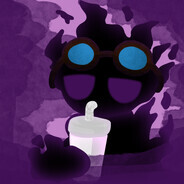

<html>
    <body style="background-color: rgb(36, 10, 53);">
        <head>
            <title>THZKleo Project Updates</title>
            <link rel="icon" href="av.jpg">
            <link href="https://fonts.googleapis.com/css2?family=Poppins:wght@400;700&display=swap" rel="stylesheet">
            
        </head>
            

                <h1 style="
                text-align: center;
                color: #fdfdfd;
                -webkit-text-stroke: 2px rgb(30, 4, 46);
                position: absolute;
                top: -9px;
                left: 150px;
                font-family: 'Poppins', sans-serif;
                text-decoration: underline;
                text-underline-offset: 10px;">Updates of Thatzkleo's projects</h1>

                

            

            

            
                <h5 style="
                text-align: center;
                color: #fdfdfd;
                position: absolute;
                font-size: 12px;
                top: 70%;
                left: 3%;
                font-family: 'Poppins', sans-serif;">© 2026 ThatzKleo. All rights reserved.</h5>

            

    </body>
</html>
